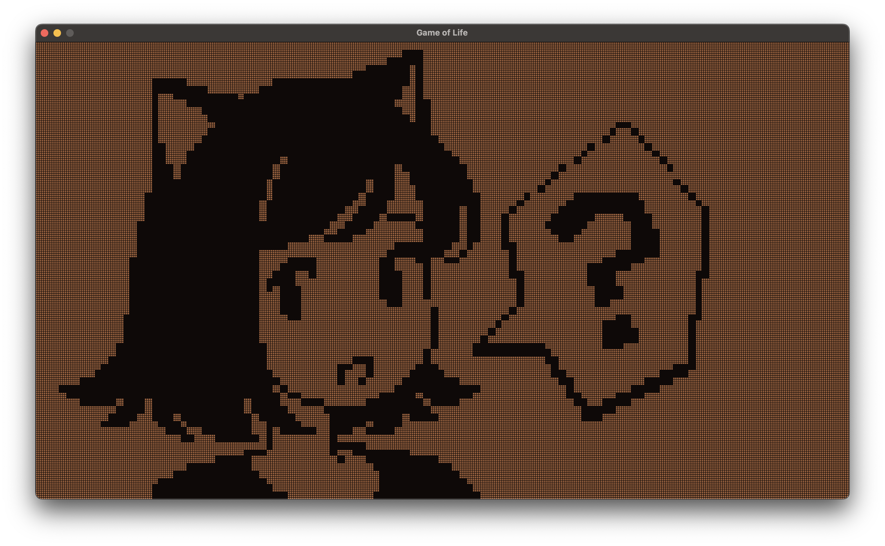

# Game of Life written in C
<div class="center">
    
</div>

Game of Life written in C with SDL3. Everything is rendered into a color buffer (inspired by Pikuma's awesome 3D Graphics course). The awesome Pixel Art was made by `sako`. 
## Prerequisites
Make sure you have `SDL3` and `SDL3 Image` installed on your system. See [here](https://wiki.libsdl.org/SDL3/Installation) for further instructions.

## Building
In order to build just run the command `make` from the `root directory (not src`:

```bash
make
```

In order to run the Executable simply launch it or type:
```bash
make run
```

## Controls
- Press the `D` Key in order to toggle between `running` and `drawing` mode.
- Press the `G` Key in order to toggle showing and hiding the grid.

## References

- [SDL3 Hello World Example](https://github.com/libsdl-org/SDL_helloworld/blob/main/main.c)
- [Pikuma 3D Graphics Course](https://pikuma.com/courses/learn-3d-computer-graphics-programming)
- [Pixel Art by Sako](https://bsky.app/profile/sako.works/post/3ktqdflzkig2d)
